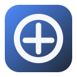
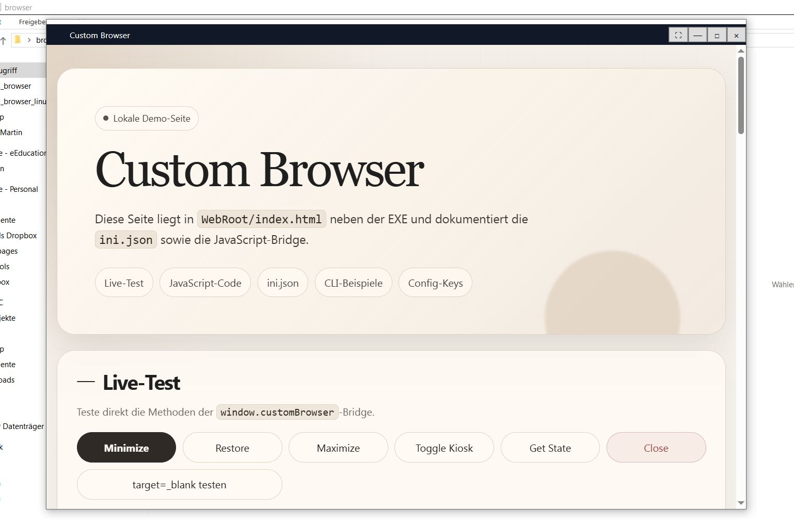
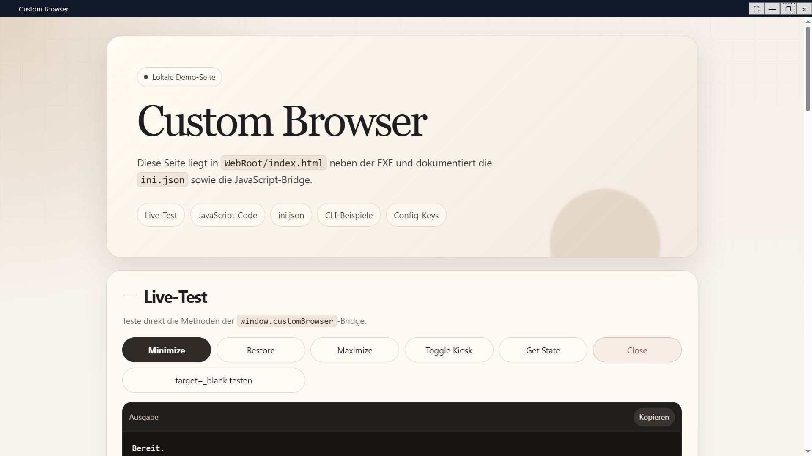
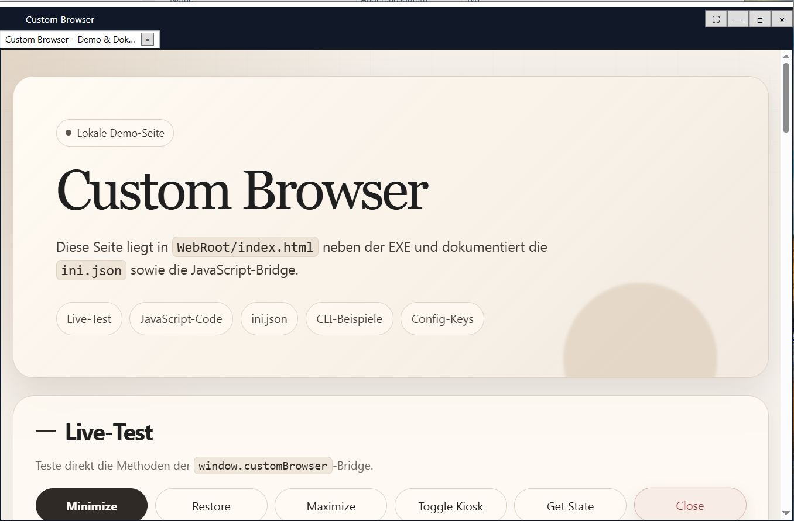
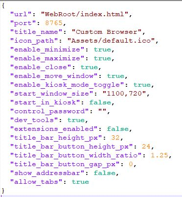

# custom-webbrowser

<p align="center">
  
  
  
  
  
  
</p>

<p align="center">
  Configurable Chromium-based browser shell for Windows and Linux with kiosk mode, JSON defaults and CLI flags.
</p>

<p align="center">
  <a href="#deutsch">Deutsch</a> |
  <a href="#english">English</a>
</p>

---

<p align="center">
  
</p>

## Screenshots

| Normal window | Maximized window |
| --- | --- |
|  |  |

| Maximized with allowed tabs | Settings |
| --- | --- |
|  |  |

---

## Deutsch

`custom-web-shell/custom-webbrowser` ist ein kleiner, flexibel konfigurierbarer Browser für Windows und Linux.

Die Anwendung lädt eine Webseite oder eine lokale HTML-Datei in einer modernen WebView-Umgebung. Unter Windows wird Microsoft Edge WebView2 verwendet. Unter Linux wird Qt6 mit Qt WebEngine verwendet. Dadurch ist es ein voll funktionsfähiger Browser mit Unterstützung für moderne Webstandards wie HTML5, CSS3 und ES6+.

Die komplette Anwendung kann über eine `ini.json` neben der ausführbaren Datei konfiguriert werden. Jede Einstellung kann zusätzlich per Kommandozeilen-Flag überschrieben werden.

Das Projekt eignet sich für Kiosk-Systeme, lokale Web-Apps, Dashboards, Infoterminals, Touch-Oberflächen, interne Tools, eingebettete Browser-Oberflächen und kontrollierte WebView-Umgebungen.

### Anwendungsbeispiele

- Kiosk-Terminal für Kunden oder Besucher
- Digital-Signage-Anzeige
- Dashboard auf einem Monitor oder Touchscreen
- Lokale HTML-/JavaScript-App ohne normalen Browserrahmen
- Web-App als Desktop-Anwendung
- Interne Firmenanwendung mit fester URL
- Steuerungsoberfläche für Maschinen, Geräte oder Panels
- Präsentations- oder Informationssystem
- Geschlossene Browserumgebung mit deaktivierten Buttons
- Testumgebung für lokale Web-Oberflächen

### Versionen

Dieses Repository enthält zwei Implementierungen:

- Windows-Version mit C#, .NET, WPF und Microsoft Edge WebView2
- Linux-Version mit C++, Qt6, Qt WebEngine und Qt WebChannel

Beide Versionen folgen demselben Konfigurationsprinzip.

### Funktionen

- Voll funktionsfähige Browser-Shell auf Chromium-Basis
- Unterstützung für HTML5, CSS3 und ES6+
- Konfigurierbare Start-URL oder lokale HTML-Datei
- Relative Pfade basierend auf `ini.json` oder dem Programmverzeichnis
- Benutzerdefinierter Fenstertitel
- Benutzerdefiniertes Fenster-Icon
- Native oder eigene Titelleiste
- Optionaler Minimieren-Button
- Optionaler Maximieren-Button
- Optionaler Schließen-Button
- Optional verschiebbares Fenster
- Optionaler Kioskmodus-Schalter
- Optionaler Kiosk-/Pin-Button im Inhalt
- Optionaler Start direkt im Kioskmodus
- Optionaler Passwortschutz für geschützte Aktionen
- Optional aktivierbare Entwicklerwerkzeuge
- Optional aktivierbare Erweiterungen, sofern unterstützt
- Optional aktivierbare oder deaktivierbare Autofill-Funktion
- Optional aktivierbares oder deaktivierbares Passwortspeichern
- Optional aktivierbare oder deaktivierbare Übersetzungsfunktion
- Optionale Adressleiste
- Optionale Tabs
- JavaScript-Bridge zur Fenstersteuerung
- JSON-Standardwerte über `ini.json`
- CLI-Overrides für alle unterstützten Einstellungen
- Build-Version per CMake- oder .NET-Parameter setzbar

### Konfiguration

Beispiel für `ini.json`:

```json
{
  "url": "WebRoot/index.html",
  "port": 8080,
  "title": "Custom Web Shell",
  "icon_path": "Assets/default.svg",

  "enable_minimize": true,
  "enable_maximize": true,
  "enable_close": true,
  "enable_move_window": true,
  "enable_kiosk_mode_toggle": true,

  "start_window_size": "1280x720",
  "start_in_kiosk": false,
  "password": "",

  "dev_tools": false,
  "extensions_enabled": false,

  "enable_autofill": true,
  "enable_password_saving": false,
  "enable_translate": true,

  "titlebar_style": "native",
  "show_kiosk_button_in_content": true,
  "kiosk_button_icon_type": "unicode",
  "kiosk_button_icon": "📌",
  "kiosk_button_text": "📌",
  "kiosk_button_tooltip": "Kiosk-Modus umschalten",

  "custom_titlebar_background": "#202124",
  "custom_titlebar_foreground": "#ffffff",
  "custom_titlebar_button_hover": "rgba(255, 255, 255, 0.16)",
  "custom_titlebar_close_hover": "#d93025",

  "content_kiosk_bar_background": "#f3f4f6",
  "content_kiosk_bar_foreground": "#111827",

  "title_bar_height_px": 32,
  "title_bar_button_height_px": 24,
  "title_bar_button_width_ratio": 1.25,
  "title_bar_button_gap_px": 0,

  "show_addressbar": false,
  "allow_tabs": false
}
```

### Konfigurationswerte

| Schlüssel | Typ | Beschreibung |
|---|---:|---|
| `url` | String | Startadresse. Kann eine URL oder eine lokale HTML-Datei sein, zum Beispiel `WebRoot/index.html`. Relative Pfade werden relativ zur `ini.json` beziehungsweise zur ausführbaren Datei aufgelöst. |
| `port` | Zahl | Port für lokale Nutzung oder spätere lokale Serverfunktionen. |
| `title` | String | Fenstertitel. |
| `title_name` | String | Alias für `title`, falls ältere Konfigurationen diesen Namen verwenden. |
| `icon_path` | String | Pfad zum Fenster-Icon. Relative Pfade werden relativ zur `ini.json` aufgelöst. |
| `enable_minimize` | Boolean | Aktiviert oder deaktiviert die Minimieren-Funktion. |
| `enable_maximize` | Boolean | Aktiviert oder deaktiviert die Maximieren-Funktion. |
| `enable_close` | Boolean | Aktiviert oder deaktiviert die Schließen-Funktion. |
| `enable_move_window` | Boolean | Legt fest, ob das Fenster verschoben werden darf. |
| `enable_movement` | Boolean | Alias für `enable_move_window`. |
| `enable_kiosk_mode_toggle` | Boolean | Aktiviert oder deaktiviert den Button beziehungsweise die API zum Umschalten des Kioskmodus. |
| `start_window_size` | String | Startgröße des Fensters. Unterstützt Werte wie `1280x720`, `1100,720`, `auto`, `maximize` oder `minimize`. |
| `start_in_kiosk` | Boolean | Startet die Anwendung direkt im Kioskmodus. |
| `password` | String | Optionales Passwort für geschützte Aktionen. Leer bedeutet: keine Passwortabfrage. |
| `control_password` | String | Alias für `password`. |
| `dev_tools` | Boolean | Aktiviert oder deaktiviert Entwicklerwerkzeuge. |
| `extensions_enabled` | Boolean | Aktiviert oder deaktiviert Erweiterungen, sofern die jeweilige Plattform dies unterstützt. |
| `enable_autofill` | Boolean | Aktiviert oder deaktiviert Autofill für Formularfelder, sofern unterstützt. |
| `enable_password_saving` | Boolean | Aktiviert oder deaktiviert das Speichern von Passwörtern im Browser. |
| `enable_translate` | Boolean | Aktiviert oder deaktiviert die Browser-Übersetzungsfunktion, sofern unterstützt. |
| `titlebar_style` | String | Legt die Titelleiste fest. Empfohlene Werte: `native` oder `custom`. |
| `show_kiosk_button_in_content` | Boolean | Zeigt den Kiosk-/Pin-Button im Inhalt an, wenn die native Titelleiste verwendet wird. |
| `kiosk_button_icon_type` | String | Typ des Kiosk-Icons. Unterstützte Werte: `unicode`, `text`, `ascii`, `theme`, `svg`, `image`, `png`, `ico`. |
| `kiosk_button_icon` | String | Icon-Wert oder Dateipfad für den Kiosk-/Pin-Button. |
| `kiosk_button_text` | String | Fallback-Text für den Kiosk-/Pin-Button. |
| `kiosk_button_tooltip` | String | Tooltip für den Kiosk-/Pin-Button. |
| `custom_titlebar_background` | String | Hintergrundfarbe der eigenen Titelleiste. |
| `custom_titlebar_foreground` | String | Text- und Symbolfarbe der eigenen Titelleiste. |
| `custom_titlebar_button_hover` | String | Hover-Farbe für normale Titelleisten-Buttons. |
| `custom_titlebar_close_hover` | String | Hover-Farbe für den Schließen-Button. |
| `content_kiosk_bar_background` | String | Hintergrundfarbe der Kiosk-Leiste im Inhalt. |
| `content_kiosk_bar_foreground` | String | Text- und Symbolfarbe der Kiosk-Leiste im Inhalt. |
| `title_bar_height_px` | Zahl | Höhe der eigenen Titelleiste in Pixeln. |
| `title_bar_button_height_px` | Zahl | Höhe der Buttons in der Titelleiste in Pixeln. |
| `title_bar_button_width_ratio` | Zahl | Breitenverhältnis der Titelleisten-Buttons. |
| `title_bar_button_gap_px` | Zahl | Abstand zwischen den Buttons in Pixeln. |
| `show_addressbar` | Boolean | Zeigt oder versteckt die Adressleiste. |
| `allow_tabs` | Boolean | Aktiviert oder deaktiviert Tabs. |

### Titelleiste

Die Titelleiste kann nativ oder selbst gezeichnet sein.

```json
"titlebar_style": "native"
```

Bei `native` verwendet die Anwendung die echte Fensterleiste des Betriebssystems. Dadurch sehen Minimieren, Maximieren und Schließen unter Windows und Linux wie normale Systembuttons aus.

```json
"titlebar_style": "custom"
```

Bei `custom` verwendet die Anwendung die eigene Titelleiste. In diesem Modus können Farben, Abstände und Buttons stärker angepasst werden.

Wichtig: Ein eigener Kiosk-/Pin-Button ist kein normaler Windows- oder Linux-Fensterbutton. Wenn `titlebar_style` auf `native` steht, kann der Kiosk-/Pin-Button deshalb optional in einer kleinen Leiste im Inhalt angezeigt werden.

```json
"show_kiosk_button_in_content": true
```

### Kiosk-/Pin-Button

Beispiele:

```json
{
  "kiosk_button_icon_type": "unicode",
  "kiosk_button_icon": "📌",
  "kiosk_button_text": "📌"
}
```

```json
{
  "kiosk_button_icon_type": "svg",
  "kiosk_button_icon": "Assets/pin.svg",
  "kiosk_button_text": "📌"
}
```

```json
{
  "kiosk_button_icon_type": "theme",
  "kiosk_button_icon": "window-pin",
  "kiosk_button_text": "📌"
}
```

Empfohlen:

- `unicode` für einfache und robuste Konfiguration
- `svg` für ein festes professionelles Design
- `theme` für Linux-Icon-Themes, falls verfügbar

### Kommandozeilen-Beispiele

```bash
./CustomBrowser --url=WebRoot/index.html --title="Dashboard"
```

```bash
./CustomBrowser --start_in_kiosk=true --enable_close=false
```

```bash
./CustomBrowser --show_addressbar=true --allow_tabs=true
```

```bash
./CustomBrowser --titlebar_style=native --show_kiosk_button_in_content=true
```

```bash
./CustomBrowser --enable_autofill=false --enable_password_saving=false --enable_translate=false
```

Die Adressleisten-Option unterstützt zusätzlich diese Aliase:

```bash
--show_adressbar=true
--addressbar=true
```

Die Tab-Option unterstützt zusätzlich:

```bash
--tabs=true
```

Die Bewegungs-Option unterstützt zusätzlich:

```bash
--enable_movement=false
```

### JavaScript-Bridge

Die Anwendung stellt der geladenen Seite eine kleine JavaScript-API bereit.

```javascript
await window.customBrowser.minimize();
await window.customBrowser.restore();
await window.customBrowser.maximize();
await window.customBrowser.toggleKiosk();
await window.customBrowser.close();
```

Wenn ein Passwort konfiguriert ist, wird es als Argument übergeben:

```javascript
await window.customBrowser.toggleKiosk("password");
```

Der aktuelle Status kann so abgefragt werden:

```javascript
const state = await window.customBrowser.getState();
console.log(state);
```

Mögliches Beispiel für eine eigene HTML-Steuerung:

```html
<button onclick="window.customBrowser.minimize()">Minimize</button>
<button onclick="window.customBrowser.restore()">Restore</button>
<button onclick="window.customBrowser.maximize()">Maximize</button>
<button onclick="window.customBrowser.toggleKiosk()">Toggle kiosk</button>
<button onclick="window.customBrowser.close()">Close</button>
```

Mit Passwort:

```html
<button onclick="window.customBrowser.toggleKiosk('password')">
  Toggle kiosk
</button>
```

### Linux-Build

AMD64:

```bash
make linux-amd64
```

ARM64 / aarch64:

```bash
make linux-arm64
```

oder:

```bash
make linux-aarch64
```

Manueller AMD64-Build:

```bash
rm -rf build/linux-amd64
cmake -S . -B build/linux-amd64 \
  -DCMAKE_BUILD_TYPE=Release \
  -DAPP_VERSION=1.5.0.0 \
  -DQt6_DIR=/usr/lib/x86_64-linux-gnu/cmake/Qt6 \
  -DCMAKE_PREFIX_PATH=/usr/lib/x86_64-linux-gnu/cmake

cmake --build build/linux-amd64 -j$(nproc)
```

Manueller ARM64-Cross-Build:

```bash
rm -rf build/linux-arm64
cmake -S . -B build/linux-arm64 \
  -DCMAKE_BUILD_TYPE=Release \
  -DAPP_VERSION=1.5.0.0 \
  -DCMAKE_TOOLCHAIN_FILE=cmake/toolchains/aarch64-linux-gnu.cmake \
  -DQt6_DIR=/usr/lib/aarch64-linux-gnu/cmake/Qt6 \
  -DCMAKE_PREFIX_PATH=/usr/lib/aarch64-linux-gnu/cmake

cmake --build build/linux-arm64 -j$(nproc)
```

### C++ Build-Version

Die Version kann beim CMake-Build gesetzt werden:

```bash
cmake -S . -B build/linux-amd64 \
  -DCMAKE_BUILD_TYPE=Release \
  -DAPP_VERSION=1.5.0.0 \
  -DAPP_COMPANY="Your Company" \
  -DAPP_PRODUCT_NAME="Custom Web Shell" \
  -DAPP_DESCRIPTION="Custom Web Shell" \
  -DQt6_DIR=/usr/lib/x86_64-linux-gnu/cmake/Qt6
```

Unter Linux kann die Version im Programm, in Logs oder in Paketmetadaten verwendet werden.

Bei einem Windows-Build mit C++ kann zusätzlich eine `version.rc` eingebunden werden, damit die EXE Dateiinformationen wie Produktname, Dateiversion und Hersteller enthält.

### Linux-Paketierung

Die Linux-Version kann als kleines `.tar.gz`-Archiv für AMD64 und ARM64 paketiert werden.

Das Paket bündelt Qt oder Systembibliotheken nicht direkt. Stattdessen enthält es eine Abhängigkeitsliste und ein Installationsskript für Debian- und Ubuntu-basierte Systeme.

Pakete erstellen:

```bash
chmod +x package-linux.sh
./package-linux.sh
```

Ausgabe:

```text
dist/tgz/custom-web-shell-YYYY.MM.DD-linux-amd64.tar.gz
dist/tgz/custom-web-shell-YYYY.MM.DD-linux-arm64.tar.gz
```

Jedes Archiv enthält:

```text
CustomBrowser
ini.json
Assets/
WebRoot/
run.sh
install-deps-debian.sh
dependencies/debian-packages.txt
INSTALL.md
```

Installation auf dem Zielsystem:

```bash
tar -xzf custom-web-shell-YYYY.MM.DD-linux-amd64.tar.gz
cd custom-web-shell-YYYY.MM.DD-linux-amd64
./install-deps-debian.sh
./run.sh
```

Für ARM64 wird das ARM64-Archiv verwendet:

```bash
tar -xzf custom-web-shell-YYYY.MM.DD-linux-arm64.tar.gz
cd custom-web-shell-YYYY.MM.DD-linux-arm64
./install-deps-debian.sh
./run.sh
```

Das Zielsystem muss zur jeweiligen CPU-Architektur passen.

### Windows-Build

Als Single-File-Anwendung veröffentlichen:

```powershell
dotnet publish .\CustomBrowser.csproj -c Release -r win-x64 --self-contained true /p:PublishSingleFile=true /p:IncludeNativeLibrariesForSelfExtract=true /p:EnableCompressionInSingleFile=true /p:PublishTrimmed=false
```

Mit Versionsdaten:

```powershell
dotnet publish .\CustomBrowser.csproj -c Release -r win-x64 --self-contained true /p:PublishSingleFile=true /p:IncludeNativeLibrariesForSelfExtract=true /p:EnableCompressionInSingleFile=true /p:PublishTrimmed=false /p:Version=1.5.0.0 /p:AssemblyVersion=1.5.0.0 /p:FileVersion=1.5.0.0 /p:InformationalVersion=1.5.0.0 /p:Company="Your Company" /p:Product="Custom Web Shell" /p:Description="Custom Web Shell"
```

### Laufzeitdateien

Die ausführbare Datei erwartet diese Dateien und Ordner neben sich:

```text
CustomBrowser
ini.json
Assets/
WebRoot/
```

Unter Windows ist die ausführbare Datei normalerweise:

```text
CustomBrowser.exe
```

Paketierte Linux-Archive enthalten zusätzlich:

```text
run.sh
install-deps-debian.sh
dependencies/debian-packages.txt
INSTALL.md
```

### Repository-Name und Beschreibung

Empfohlener Repository-Name:

```text
custom-web-shell
```

Empfohlene Kurzbeschreibung:

```text
Configurable Chromium-based browser shell for Windows and Linux with kiosk mode, JSON defaults and CLI flags.
```

### Drittanbieter-Software

Danke an alle Projekte, Frameworks, Laufzeiten, Bibliotheken und Werkzeuge, die in diesem Projekt verwendet werden.

Dazu gehören je nach Zielplattform:

- Microsoft Edge WebView2 Runtime
- .NET
- WPF
- Qt
- Qt WebEngine
- Qt WebChannel
- Chromium
- CMake
- GCC-, MinGW- und MSVC-Toolchains
- Debian- und Ubuntu-Paketbetreuer
- alle Open-Source-Mitwirkenden, deren Arbeit Projekte wie dieses möglich macht

Drittanbieter-Komponenten bleiben unter ihren jeweiligen Lizenzen.

### Lizenz

Dieses Projekt ist Open Source und unter der GNU Affero General Public License v3.0 oder später lizenziert.

Copyright (C) 2026 Andreas Rottmann

---

## English

`custom-web-shell/custom-webbrowser` is a small and flexible browser for Windows and Linux.

The application loads a website or a local HTML file in a modern WebView environment. On Windows it uses Microsoft Edge WebView2. On Linux it uses Qt6 with Qt WebEngine. This makes it a fully functional browser with support for modern web standards such as HTML5, CSS3 and ES6+.

The complete application can be configured through an `ini.json` file next to the executable. Every setting can also be overridden with a command line flag.

The project is useful for kiosk systems, local web apps, dashboards, information terminals, touch interfaces, internal tools, embedded browser UIs and controlled WebView environments.

### Example use cases

- Kiosk terminal for customers or visitors
- Digital signage display
- Dashboard on a monitor or touchscreen
- Local HTML/JavaScript app without a normal browser frame
- Web app packaged as a desktop application
- Internal company application with a fixed URL
- Control interface for machines, devices or panels
- Presentation or information system
- Locked browser environment with disabled buttons
- Test environment for local web interfaces

### Versions

This repository contains two implementations:

- Windows version using C#, .NET, WPF and Microsoft Edge WebView2
- Linux version using C++, Qt6, Qt WebEngine and Qt WebChannel

Both versions follow the same configuration concept.

### Features

- Fully functional Chromium-based browser shell
- Support for HTML5, CSS3 and ES6+
- Configurable start URL or local HTML file
- Relative paths based on `ini.json` or the executable directory
- Custom window title
- Custom window icon
- Native or custom title bar
- Optional minimize button
- Optional maximize button
- Optional close button
- Optional movable window
- Optional kiosk mode toggle
- Optional kiosk/pin button inside the content area
- Optional start directly in kiosk mode
- Optional password protection for protected actions
- Optional developer tools
- Optional extension support where available
- Optional browser autofill
- Optional browser password saving
- Optional browser translation feature
- Optional address bar
- Optional tab support
- JavaScript bridge for window control
- JSON defaults through `ini.json`
- CLI overrides for all supported settings
- Build version configurable through CMake or .NET parameters

### Configuration

Example `ini.json`:

```json
{
  "url": "WebRoot/index.html",
  "port": 8080,
  "title": "Custom Web Shell",
  "icon_path": "Assets/default.svg",

  "enable_minimize": true,
  "enable_maximize": true,
  "enable_close": true,
  "enable_move_window": true,
  "enable_kiosk_mode_toggle": true,

  "start_window_size": "1280x720",
  "start_in_kiosk": false,
  "password": "",

  "dev_tools": false,
  "extensions_enabled": false,

  "enable_autofill": true,
  "enable_password_saving": false,
  "enable_translate": true,

  "titlebar_style": "native",
  "show_kiosk_button_in_content": true,
  "kiosk_button_icon_type": "unicode",
  "kiosk_button_icon": "📌",
  "kiosk_button_text": "📌",
  "kiosk_button_tooltip": "Toggle kiosk mode",

  "custom_titlebar_background": "#202124",
  "custom_titlebar_foreground": "#ffffff",
  "custom_titlebar_button_hover": "rgba(255, 255, 255, 0.16)",
  "custom_titlebar_close_hover": "#d93025",

  "content_kiosk_bar_background": "#f3f4f6",
  "content_kiosk_bar_foreground": "#111827",

  "title_bar_height_px": 32,
  "title_bar_button_height_px": 24,
  "title_bar_button_width_ratio": 1.25,
  "title_bar_button_gap_px": 0,

  "show_addressbar": false,
  "allow_tabs": false
}
```

### Configuration values

| Key | Type | Description |
|---|---:|---|
| `url` | String | Start address. Can be a URL or a local HTML file, for example `WebRoot/index.html`. Relative paths are resolved relative to `ini.json` or the executable. |
| `port` | Number | Port for local use or future local server features. |
| `title` | String | Window title. |
| `title_name` | String | Alias for `title` for older configurations. |
| `icon_path` | String | Path to the window icon. Relative paths are resolved relative to `ini.json`. |
| `enable_minimize` | Boolean | Enables or disables the minimize action. |
| `enable_maximize` | Boolean | Enables or disables the maximize action. |
| `enable_close` | Boolean | Enables or disables the close action. |
| `enable_move_window` | Boolean | Defines whether the window can be moved. |
| `enable_movement` | Boolean | Alias for `enable_move_window`. |
| `enable_kiosk_mode_toggle` | Boolean | Enables or disables the button and API for toggling kiosk mode. |
| `start_window_size` | String | Initial window size. Supports values like `1280x720`, `1100,720`, `auto`, `maximize` or `minimize`. |
| `start_in_kiosk` | Boolean | Starts the application directly in kiosk mode. |
| `password` | String | Optional password for protected actions. Empty means no password check. |
| `control_password` | String | Alias for `password`. |
| `dev_tools` | Boolean | Enables or disables developer tools. |
| `extensions_enabled` | Boolean | Enables or disables extensions where supported by the target platform. |
| `enable_autofill` | Boolean | Enables or disables browser autofill for form fields where supported. |
| `enable_password_saving` | Boolean | Enables or disables browser password saving. |
| `enable_translate` | Boolean | Enables or disables the browser translation feature where supported. |
| `titlebar_style` | String | Selects the title bar. Recommended values: `native` or `custom`. |
| `show_kiosk_button_in_content` | Boolean | Shows the kiosk/pin button inside the content area when the native title bar is used. |
| `kiosk_button_icon_type` | String | Type of the kiosk icon. Supported values: `unicode`, `text`, `ascii`, `theme`, `svg`, `image`, `png`, `ico`. |
| `kiosk_button_icon` | String | Icon value or file path for the kiosk/pin button. |
| `kiosk_button_text` | String | Fallback text for the kiosk/pin button. |
| `kiosk_button_tooltip` | String | Tooltip for the kiosk/pin button. |
| `custom_titlebar_background` | String | Background color of the custom title bar. |
| `custom_titlebar_foreground` | String | Text and icon color of the custom title bar. |
| `custom_titlebar_button_hover` | String | Hover color for normal title bar buttons. |
| `custom_titlebar_close_hover` | String | Hover color for the close button. |
| `content_kiosk_bar_background` | String | Background color of the kiosk bar inside the content area. |
| `content_kiosk_bar_foreground` | String | Text and icon color of the kiosk bar inside the content area. |
| `title_bar_height_px` | Number | Height of the custom title bar in pixels. |
| `title_bar_button_height_px` | Number | Height of the title bar buttons in pixels. |
| `title_bar_button_width_ratio` | Number | Width ratio of the title bar buttons. |
| `title_bar_button_gap_px` | Number | Gap between buttons in pixels. |
| `show_addressbar` | Boolean | Shows or hides the address bar. |
| `allow_tabs` | Boolean | Enables or disables tabs. |

### Title bar

The title bar can be native or custom.

```json
"titlebar_style": "native"
```

With `native`, the application uses the real operating system title bar. Minimize, maximize and close look like normal system buttons on Windows and Linux.

```json
"titlebar_style": "custom"
```

With `custom`, the application uses its own title bar. In this mode, colors, spacing and buttons can be customized more freely.

Important: A kiosk/pin button is not a standard Windows or Linux window button. If `titlebar_style` is set to `native`, the kiosk/pin button can optionally be shown in a small content bar.

```json
"show_kiosk_button_in_content": true
```

### Kiosk/pin button

Examples:

```json
{
  "kiosk_button_icon_type": "unicode",
  "kiosk_button_icon": "📌",
  "kiosk_button_text": "📌"
}
```

```json
{
  "kiosk_button_icon_type": "svg",
  "kiosk_button_icon": "Assets/pin.svg",
  "kiosk_button_text": "📌"
}
```

```json
{
  "kiosk_button_icon_type": "theme",
  "kiosk_button_icon": "window-pin",
  "kiosk_button_text": "📌"
}
```

Recommended:

- `unicode` for simple and robust configuration
- `svg` for a fixed professional design
- `theme` for Linux icon themes, if available

### Command line examples

```bash
./CustomBrowser --url=WebRoot/index.html --title="Dashboard"
```

```bash
./CustomBrowser --start_in_kiosk=true --enable_close=false
```

```bash
./CustomBrowser --show_addressbar=true --allow_tabs=true
```

```bash
./CustomBrowser --titlebar_style=native --show_kiosk_button_in_content=true
```

```bash
./CustomBrowser --enable_autofill=false --enable_password_saving=false --enable_translate=false
```

The address bar option also supports these aliases:

```bash
--show_adressbar=true
--addressbar=true
```

The tabs option also supports:

```bash
--tabs=true
```

The movement option also supports:

```bash
--enable_movement=false
```

### JavaScript bridge

The application exposes a small JavaScript API to the loaded page.

```javascript
await window.customBrowser.minimize();
await window.customBrowser.restore();
await window.customBrowser.maximize();
await window.customBrowser.toggleKiosk();
await window.customBrowser.close();
```

If a password is configured, pass it as an argument:

```javascript
await window.customBrowser.toggleKiosk("password");
```

The current state can be requested with:

```javascript
const state = await window.customBrowser.getState();
console.log(state);
```

Example for a custom HTML control panel:

```html
<button onclick="window.customBrowser.minimize()">Minimize</button>
<button onclick="window.customBrowser.restore()">Restore</button>
<button onclick="window.customBrowser.maximize()">Maximize</button>
<button onclick="window.customBrowser.toggleKiosk()">Toggle kiosk</button>
<button onclick="window.customBrowser.close()">Close</button>
```

With password:

```html
<button onclick="window.customBrowser.toggleKiosk('password')">
  Toggle kiosk
</button>
```

### Linux build

AMD64:

```bash
make linux-amd64
```

ARM64 / aarch64:

```bash
make linux-arm64
```

or:

```bash
make linux-aarch64
```

Manual AMD64 build:

```bash
rm -rf build/linux-amd64
cmake -S . -B build/linux-amd64 \
  -DCMAKE_BUILD_TYPE=Release \
  -DAPP_VERSION=1.5.0.0 \
  -DQt6_DIR=/usr/lib/x86_64-linux-gnu/cmake/Qt6 \
  -DCMAKE_PREFIX_PATH=/usr/lib/x86_64-linux-gnu/cmake

cmake --build build/linux-amd64 -j$(nproc)
```

Manual ARM64 cross build:

```bash
rm -rf build/linux-arm64
cmake -S . -B build/linux-arm64 \
  -DCMAKE_BUILD_TYPE=Release \
  -DAPP_VERSION=1.5.0.0 \
  -DCMAKE_TOOLCHAIN_FILE=cmake/toolchains/aarch64-linux-gnu.cmake \
  -DQt6_DIR=/usr/lib/aarch64-linux-gnu/cmake/Qt6 \
  -DCMAKE_PREFIX_PATH=/usr/lib/aarch64-linux-gnu/cmake

cmake --build build/linux-arm64 -j$(nproc)
```

### C++ build version

The version can be set during the CMake build:

```bash
cmake -S . -B build/linux-amd64 \
  -DCMAKE_BUILD_TYPE=Release \
  -DAPP_VERSION=1.5.0.0 \
  -DAPP_COMPANY="Your Company" \
  -DAPP_PRODUCT_NAME="Custom Web Shell" \
  -DAPP_DESCRIPTION="Custom Web Shell" \
  -DQt6_DIR=/usr/lib/x86_64-linux-gnu/cmake/Qt6
```

On Linux, the version can be used inside the program, in logs or in package metadata.

For a C++ Windows build, a `version.rc` file can also be included so the EXE contains file information such as product name, file version and company name.

### Linux packaging

The Linux version can be packaged as small `.tar.gz` archives for AMD64 and ARM64.

The package does not bundle Qt or system libraries. Instead, it includes a dependency list and an install script for Debian/Ubuntu based systems.

Create packages:

```bash
chmod +x package-linux.sh
./package-linux.sh
```

Output:

```text
dist/tgz/custom-web-shell-YYYY.MM.DD-linux-amd64.tar.gz
dist/tgz/custom-web-shell-YYYY.MM.DD-linux-arm64.tar.gz
```

Each archive contains:

```text
CustomBrowser
ini.json
Assets/
WebRoot/
run.sh
install-deps-debian.sh
dependencies/debian-packages.txt
INSTALL.md
```

Install on the target system:

```bash
tar -xzf custom-web-shell-YYYY.MM.DD-linux-amd64.tar.gz
cd custom-web-shell-YYYY.MM.DD-linux-amd64
./install-deps-debian.sh
./run.sh
```

For ARM64 use the ARM64 archive:

```bash
tar -xzf custom-web-shell-YYYY.MM.DD-linux-arm64.tar.gz
cd custom-web-shell-YYYY.MM.DD-linux-arm64
./install-deps-debian.sh
./run.sh
```

The target system must use the matching CPU architecture.

### Windows build

Publish as a single-file application:

```powershell
dotnet publish .\CustomBrowser.csproj -c Release -r win-x64 --self-contained true /p:PublishSingleFile=true /p:IncludeNativeLibrariesForSelfExtract=true /p:EnableCompressionInSingleFile=true /p:PublishTrimmed=false
```

With version information:

```powershell
dotnet publish .\CustomBrowser.csproj -c Release -r win-x64 --self-contained true /p:PublishSingleFile=true /p:IncludeNativeLibrariesForSelfExtract=true /p:EnableCompressionInSingleFile=true /p:PublishTrimmed=false /p:Version=1.5.0.0 /p:AssemblyVersion=1.5.0.0 /p:FileVersion=1.5.0.0 /p:InformationalVersion=1.5.0.0 /p:Company="Your Company" /p:Product="Custom Web Shell" /p:Description="Custom Web Shell"
```

### Runtime files

The executable expects these files and folders next to it:

```text
CustomBrowser
ini.json
Assets/
WebRoot/
```

On Windows the executable is usually:

```text
CustomBrowser.exe
```

Packaged Linux archives also include:

```text
run.sh
install-deps-debian.sh
dependencies/debian-packages.txt
INSTALL.md
```

### Repository name and description

Suggested repository name:

```text
custom-web-shell
```

Suggested short description:

```text
Configurable Chromium-based browser shell for Windows and Linux with kiosk mode, JSON defaults and CLI flags.
```

### Third-party software

Thanks to all projects, frameworks, runtimes, libraries and tools used by this project.

This includes, depending on the build target:

- Microsoft Edge WebView2 Runtime
- .NET
- WPF
- Qt
- Qt WebEngine
- Qt WebChannel
- Chromium
- CMake
- GCC, MinGW and MSVC toolchains
- Debian and Ubuntu package maintainers
- all open source contributors whose work makes projects like this possible

Third-party components remain under their own licenses.

### License

This project is open source and licensed under the GNU Affero General Public License v3.0 or later.

Copyright (C) 2026 Andreas Rottmann
